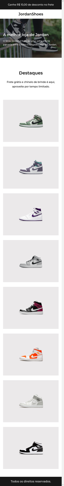

# Iuri code teste 002

Desafio simples de design resposivo Iuri Code 002 

## Referência

 - [Figma do projeto](https://www.figma.com/file/Yb9IBH56g7T1hdIyZ3BMNO/Desafios---Codel%C3%A2ndia?node-id=1973-39&t=P5hJUgJnVTAJu2x4-0)
 

## Screenshots

